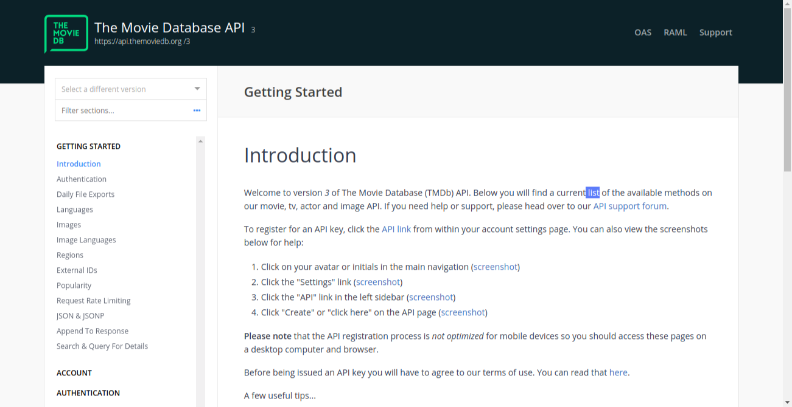
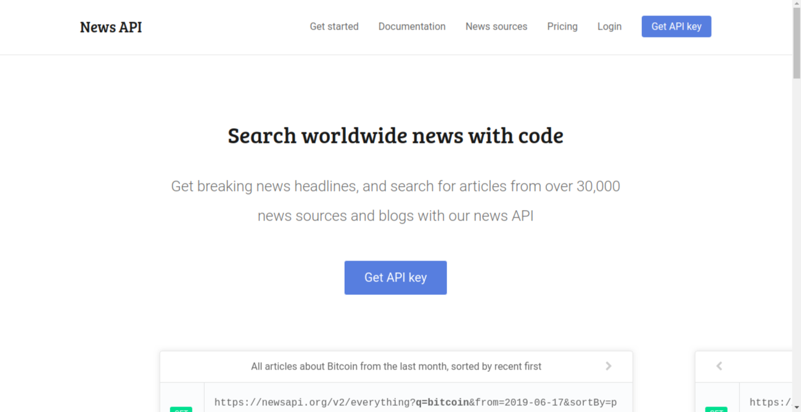

# Movies-Time
Movies Time simple web app  - by using 2 APIs .

## TEAM NAMES:
- Mai Ubaied
- yosef ElNajaar
- Asem Abu Msameh
- Asmaa Thabet

## Our Idea : 
  a Website that display Movies details with a sidebar shows Latest Movies News . 

## WHY ? 
  we make this website to deal with 2 API's in the same Page , we chose Movies Time Idea To link our Page with the same subject which is "Movies". 

## WHAT?
  Our movies website is a single page that help our clients in displaying List of Popular Movies with its details [ title , poster ,language, Overview  and Release date ] , Also to let our clients to be in touch with Latest Movies News as a sidebar Article. 

## HOW?
We divided our project in to Stages:
 
* Searching for suitables API's :
  we started our work by searching for the suitable API's which is should be Free and have unlimited number of requests so we chose to work in 2 API's that we make connection between their subjects to create awesome website.  

* Design :  
  We design our project on papers to make a general perception for the website.

* Project Strcture : 
  We started to build our project files Structure by seprate similar files in folders in order to make the project more Organized.

* Divided Tasks :
  We divided the work in tasks and started to work as pairs, Every Pair Started to work in API.

* making tests : 
  we made tests for our request to check that they were work well .

* Fetching Data From API's : 
  We work in Fetching data from API's by making XHR Requests and makeing connections between our project and the servers .

* Displaying Data In Page : 
  We show our fetched data by using dom js .

* Refactor code : 
  we made refactor for our code to raise our code performance .

* Design Website : 
  We make the design for our page to obtain the required shape from our idea and be sure that it works in mobile status as required.

* Responsive and Accessbility : 
  We chekout the Responsive case for our design and also check accessbility for the app to work in the better case.

* checking and Fixing issues : 
  Solve The issues that appears and take suggestions in mind and try to add it all to have a great website . 

## User Journey
* The User open our Website and see Landing page firstly that display the aim of our page . 
* The User scroll to see Movies section that display list of movies and its details .
* The User can see news that related to movies by looking to the sidebar in the right side of website . 
* The User reach to footer section that have the contact form , our address and contacts . 

## Used APIs :

> The MovieDB API  for [Moviedb website](https://www.themoviedb.org):
  you can find it by :
https://www.themoviedb.org/documentation/api

> The News API from [NewsAPI Website](https://newsapi.org):
  you can find it by : 
https://newsapi.org 

